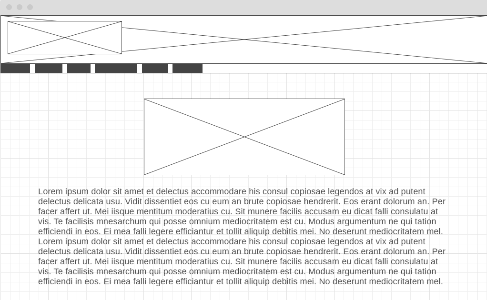
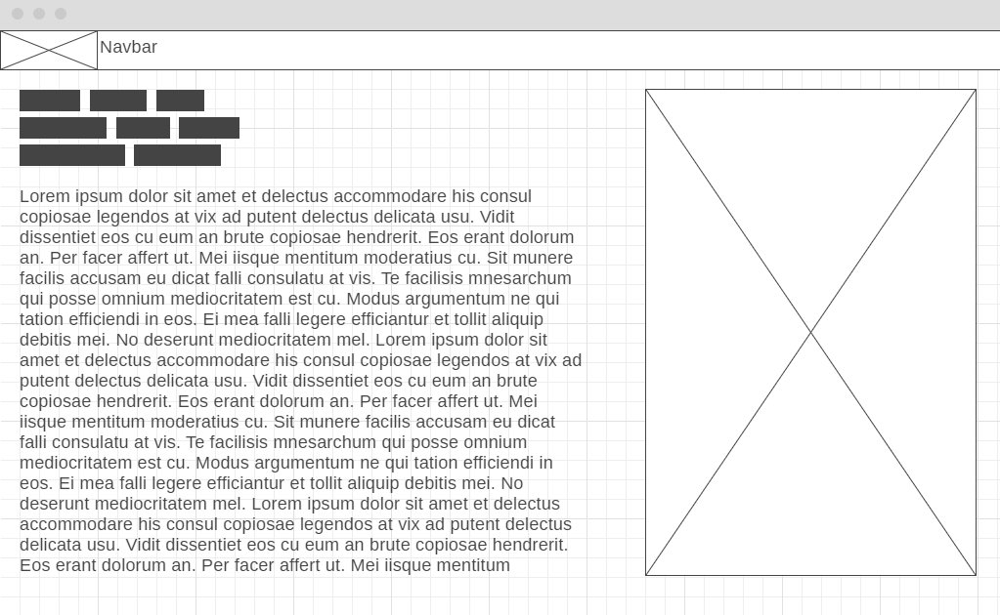
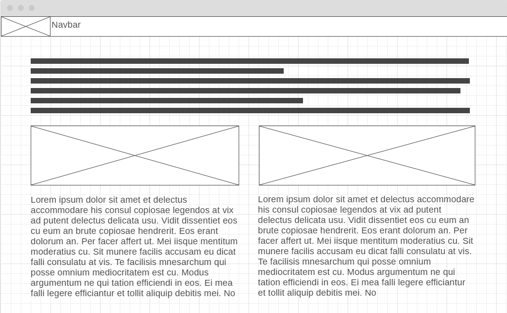
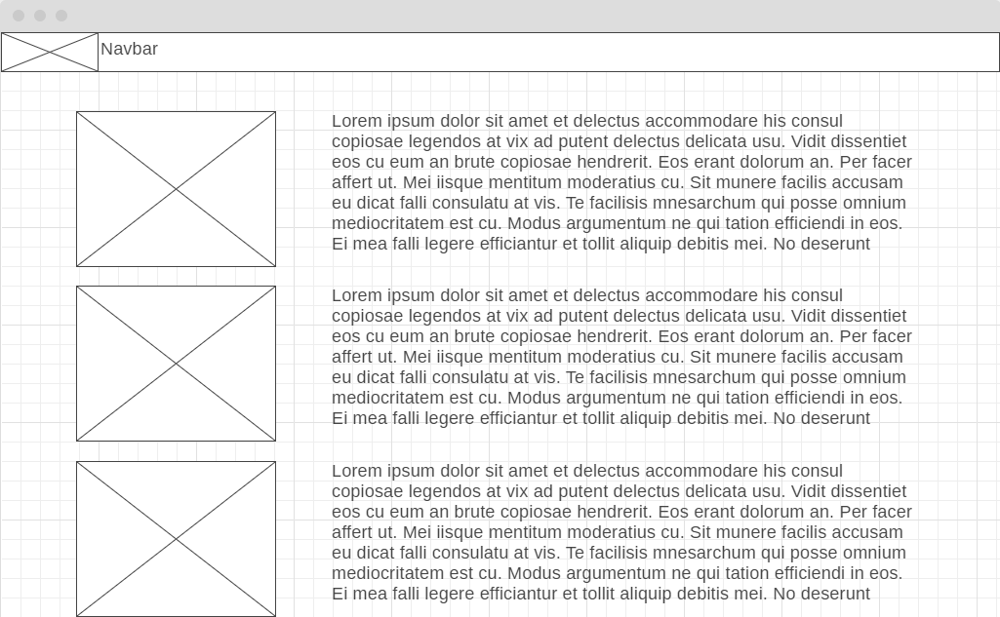
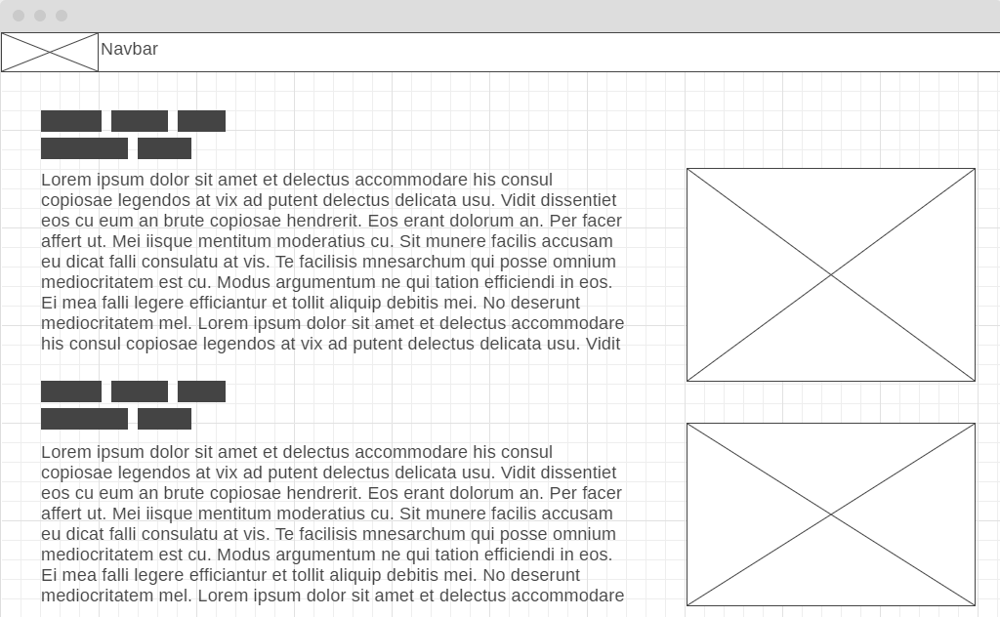
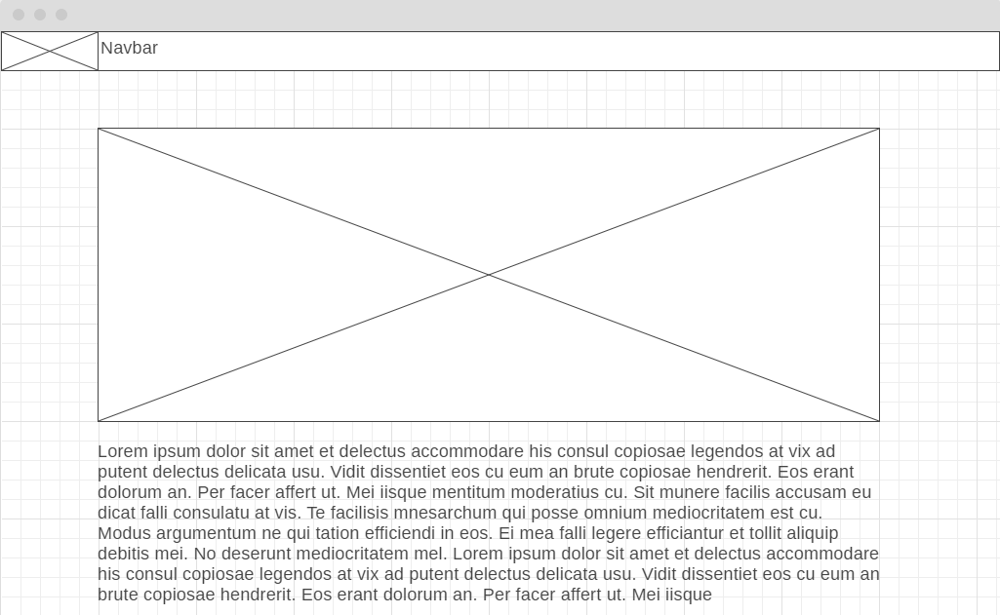
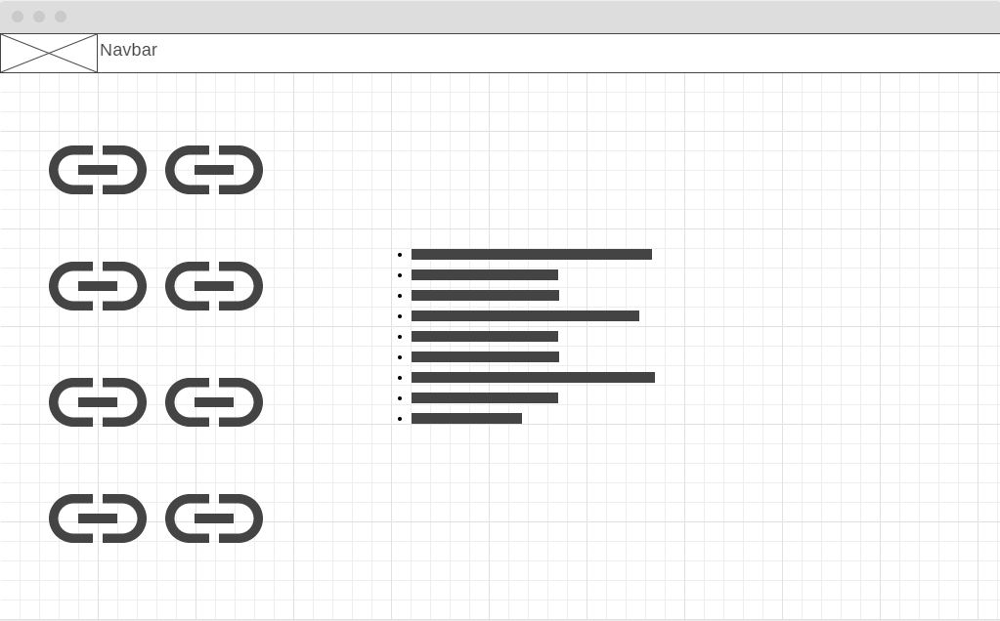
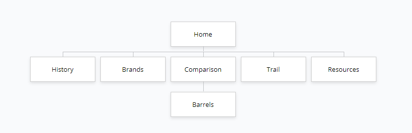
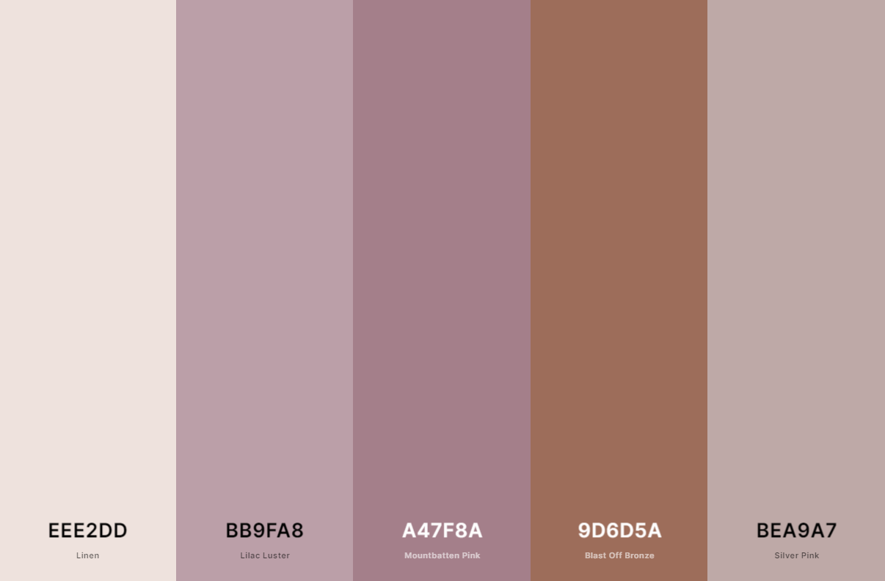

# Site Plan - 

## Overview

The purpose of this site is to provide various information on whiskey. The site will educate on the differences between whiskey and bourbon and provide information on the Whiskey Trail.

This is purely an entertainment and educational site that is static in nature with information that does not change. External links will be provided in the site to provide more information.

The design will be simple, with information presented in an easy to read and digest manner.

## Goals

### Inform
* Educate people on the types of whiskey
* Educate on the differences between whiskey and bourbon
* Learn more about all of this myself

### Promote the Whiskey Trail
*Make its existence and history known
*Influence people to consider it as a vacation location

## Target Users

The site does not have any specific target users. The users will be people interested in the subject manner of the site.

## Content

### Home
The landing page of the site that provides a brief overview and all possible navigation options.

### History
This page will provide a brief history of whiskey.

### Comparison
This page will compare whiskey and bourbon. This page will lead to the page discussing the difference in barrels used for both.

### Types
This page will discuss the various types of whiskey.

### Whiskey Trail
This page will outline a brief history and information about the whiskey trail.

### Resources
This page will link to various external resources used to make the site as well as resources for further reading.

### Navagation Bar
The navagation bar will be present at the top of every page and will be consistent accross the entire site.

## Site Map

## Palette

